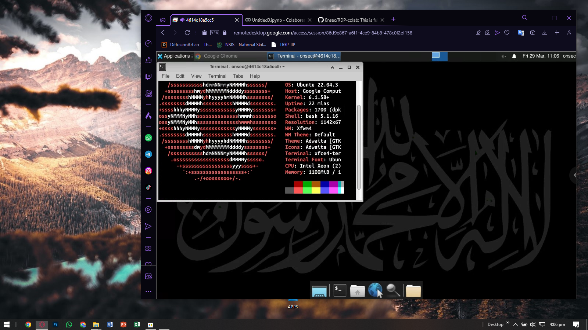

# RDP FOR HACKING WITH GRAPHIC CARD
```sh
██████╗ ███╗   ██╗███████╗███████╗ ██████╗
██╔═████╗████╗  ██║██╔════╝██╔════╝██╔════╝
██║██╔██║██╔██╗ ██║███████╗█████╗  ██║     
████╔╝██║██║╚██╗██║╚════██║██╔══╝  ██║     
╚██████╔╝██║ ╚████║███████║███████╗╚██████╗
 ╚═════╝ ╚═╝  ╚═══╝╚══════╝╚══════╝ ╚═════╝
```
## Debian (Ubuntu) Colab RDP With Google Chrome Remote Desktop (RDP)



### Ubuntu 22.04.3 LTS

VM features:
* INTEL Xeon(R) CPU @ 2.20Ghz * 2
* 12.7 GB RAM
* llvmpipe (LLVM 15.0.7, 256bits) 12.7GB GPU
* 100GB Disk
* I MOD and Some Cool Features :
  - Automatically Telegram Installed
  - Automatically Qbittorrent Installed
  - Removed Stupid/Unrated Softwares
  - Added New Wallpaper
  - Install Nmap , Metasploit, tor
  - Neofetch

## READ BEFORE USING THIS RDP 💀

* i'm **not responsible** for **suspended Google accounts**
* **Don't try these in your personal Gmail account** 
* **Don't mine will be ban Instantly**

---

### Copy and Paste the code in colab

```sh
!curl -s -L -o run.py https://raw.githubusercontent.com/0nsec/RDP-colab/main/run.py
```
```sh
!python run.py
```


<details>
    <summary>Installation and Run</summary>
<br>
    
* Copy and paste code in **Colab**
    
* Go To [**Google Chrome Remote Desktop (CRD)**](https://remotedesktop.google.com/access) Site 

* Click **Set up via SSH**

* Copy your **Debian Linux SSH** Code **(token)**
    
* Paste it in the **Colab** then hit **Enter**

* **Wait 3 - 4 Minutes**

* After You See my **Banner Art** , Go to **CRD** and Click **Remote Access**

* Double Click and Give **PIN : _123456_**

* Now You're In , Enjoy.

  </details>

</details>


  
*************************************************************************************    
